In this file I am trying to show the comparison between linear regression and KNN. This code was part of my project for my advanced data mining course with prof. Culp.
=======================================================================================================================================================================

Code for Linear Regression
==========================

``` r
bls<-function(x0,x,y){
   b = solve(t(x)%*%x)%*%t(x)%*%y
   x0%*%b
}
```

Code for KNN
============

``` r
knn<-function(x0,x,y,k){
   x=as.matrix(x)
   x0=as.matrix(x0)
   sizex = dim(x)
   D = matrix(0,sizex[1],sizex[2])
   for(i in 1:sizex[2]){
      D[,i] = x0[,i]-x[,i]
   }
   ED = rowSums(D^2, na.rm = FALSE, dims = 1)
   yord = y[order(ED)]
   sum(yord[1:k])/k 
}
```

Example for Regression (sin(x) function) - using Linear Regression
==================================================================

``` r
set.seed(100)
x=runif(100,0,2*pi)
y=sin(x)+rnorm(100,,0.1)
xgrid=seq(0,2*pi,length=500)
n=length(xgrid)
ygrid_BLS=vector(length=n)
k=15
for(i in 1:n){
    ygrid_BLS[i]=bls(xgrid[i],x,y)
}
plot(x,y,pch=16)
title (main=expression("Regression with Linear Regression"))
lines(xgrid,ygrid_BLS,col=c("red"))
lines(xgrid,sin(xgrid),col=c("blue"))
```

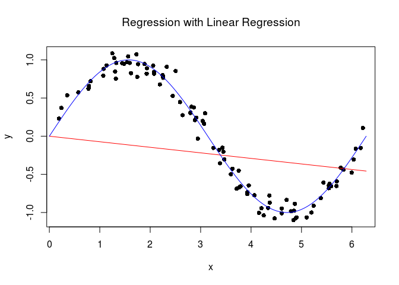

Examples for Regression (sin(x) Function) - using KNN
=====================================================

``` r
ygrid_knn=vector(length=n)
for (k in c(15,30,45,60,75,90))
{
  for(i in 1:n){
    ygrid_knn[i]=knn(xgrid[i],x,y,k)
  }
  plot(x,y,pch=16)
  title (main=paste(expression("Regression with KNN, k="), k))
  lines(xgrid,ygrid_knn,col=c("red"))
  lines(xgrid,sin(xgrid),col=c("blue"))
}
```

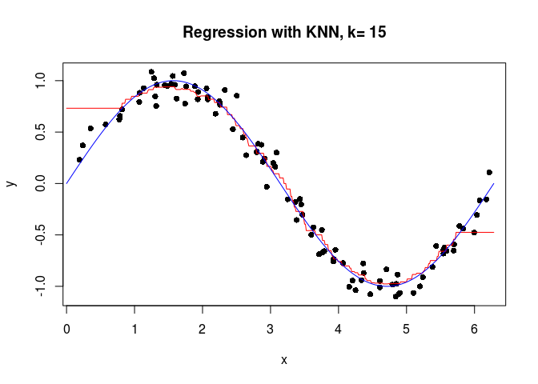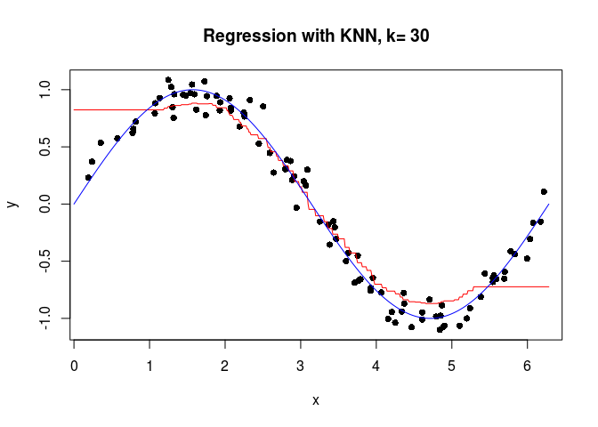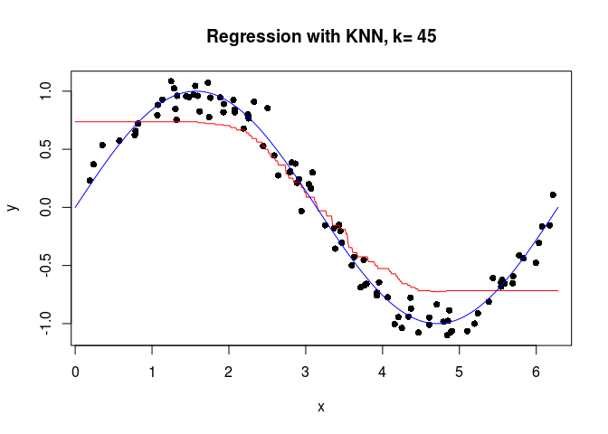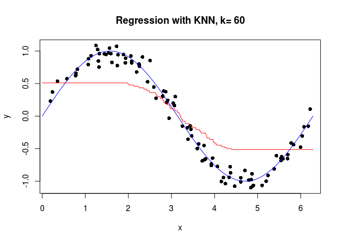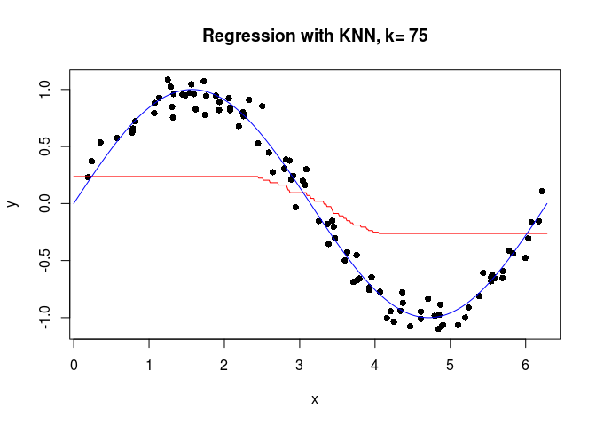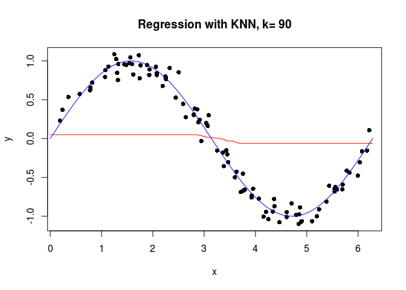

Example for Classification - using Linear Regression
====================================================

``` r
x<-read.table("dat2.txt",F)
y<-x[,3]
x<-x[,-3]
x=as.matrix(x)

xgrid1<-seq(min(x[,1]),max(x[,1]),length=100)
xgrid2<-seq(min(x[,2]),max(x[,2]),length=100)
n=length(xgrid1)
zgrid=matrix(0,n,n)
k=10
for(i in 1:n){
  for(j in 1:n){
       zgrid[i,j] = bls(cbind(xgrid1[i],xgrid2[j]),x,y)
     }
}
plot(x,col=c("orange","blue")[y+1],pch=16,xlab="x1",ylab="x2")
title (main=paste(expression("Classification with Linear Regression")))
for(i in 1:n){
    val<-as.numeric(zgrid[,i]>=0.5)+1  #classification rule
    points(xgrid1,rep(xgrid2[i],n),pch=".",col=c("orange","blue")[val])
}      
contour(xgrid1,xgrid2,zgrid,levels=0.5,add=TRUE,drawlabels=FALSE)
```

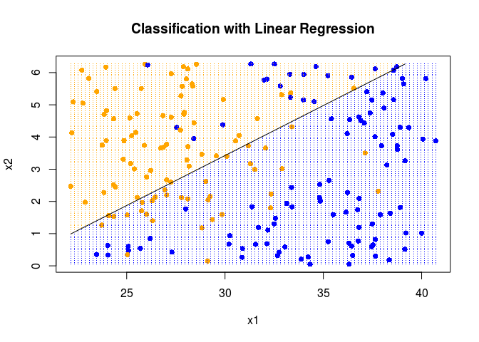

Example for Classification - using KNN
======================================

``` r
for(k in c(10,20,30,40,100)) {
  for(i in 1:n){
    for(j in 1:n){
            zgrid[i,j] = knn(cbind(xgrid1[i],xgrid2[j]),x,y,k)
      }
    }
  plot(x,col=c("orange","blue")[y+1],pch=16,xlab="x1",ylab="x2")
  title (main=paste(expression("Classification with KNN, k="), k))
  for(l in 1:n){
    val<-as.numeric(zgrid[,l]>=0.5)+1  #classification rule
    points(xgrid1,rep(xgrid2[l],n),pch=".",col=c("orange","blue")[val])
  }      
  contour(xgrid1,xgrid2,zgrid,levels=0.5,add=TRUE,drawlabels=FALSE)
}
```

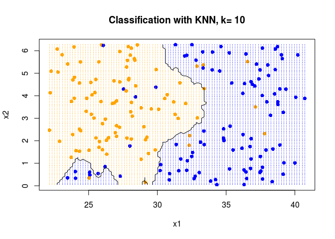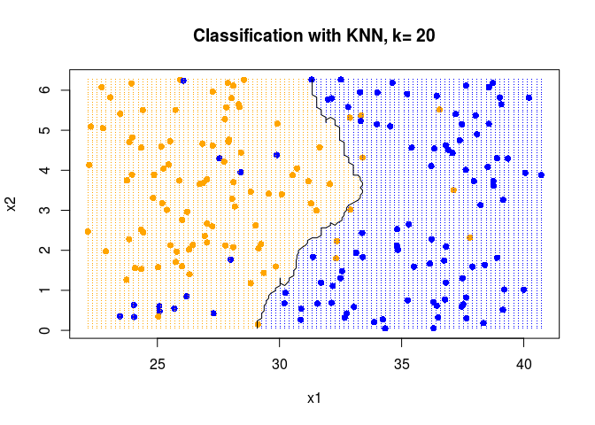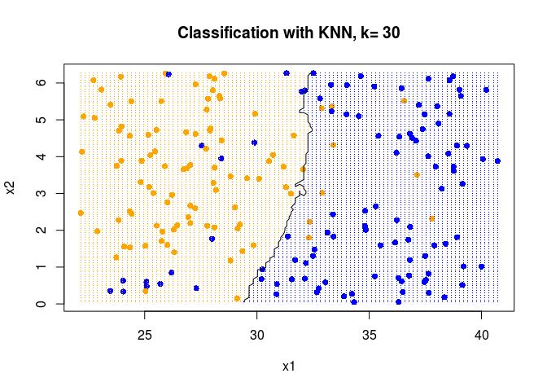
